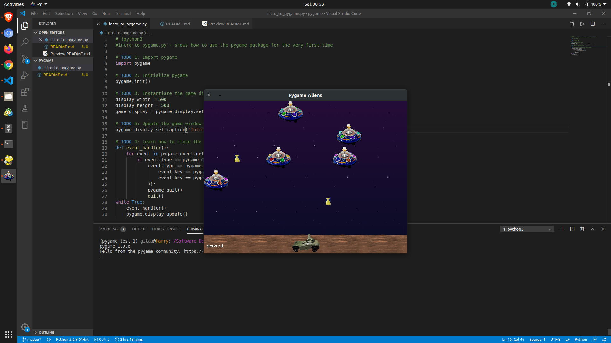

# Pygame

**What is pygame**
Pygame is a set of Python modules designed for writing video games. Pygame adds functionality on top of the excellent SDL library. This allows you to create fully featured games and multimedia programs in the python language.

**Prerequisites**

1. Basic Python knowledge
    * How to import modules
    * How to create variables
    * Using conditional statements
    * Looping
    * Functions

**Installation via the terminal**

1. Create a virtual environment
    ```mkvirtualenv test_pygame```

2. Install pip3 if you do not have it
_(I am using python3)_
    ```$ sudo update```
    ```$ sudo apt install python3-pip```
    ```$ pip3 --version```

3. Install pygame
    ```pip3 install pygame```

4. Test for successfull installation
    To enter into the interactive shell, type:
        ```python```
        ```import pygame```
    (If no error, then installation was successfull)

    OR

    ```python3 -m pygame.examples.aliens```

