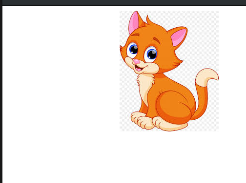

# Basic Games

**Game Demo**

Learn how to create a simple animation using ```pygame```. For example:

_How can a still image on a screen appear as though it is moving?_



* Learn how to load an image onto the canvas/game surface

    ```cat_img = pygame.image.load('cat_image.jpeg')```

* Learn how to use coordinates on a Cartesian Plane to position objects on the canvas/game surface

    ```python
    direction = 'right'

    while True:
        if direction == 'right':
            cat_x += 5
            if cat_x == 280:
                direction = 'up'
        elif direction == 'up':
            cat_y += 5
            if cat_y == 220:
                direction = 'left'
        elif direction == 'left':
            cat_x -= 5
            if cat_x == 10:
                direction = 'down'
        elif direction == 'down':
            cat_y -= 5
            if cat_y == 10:
                direction == 'right'
    ```

* Understand the concept of fps (frames per second)

    ```python
    fps = 90
    fps_clock = pygame.time.Clock()

    fps_clock.tick(fps)
    ```
